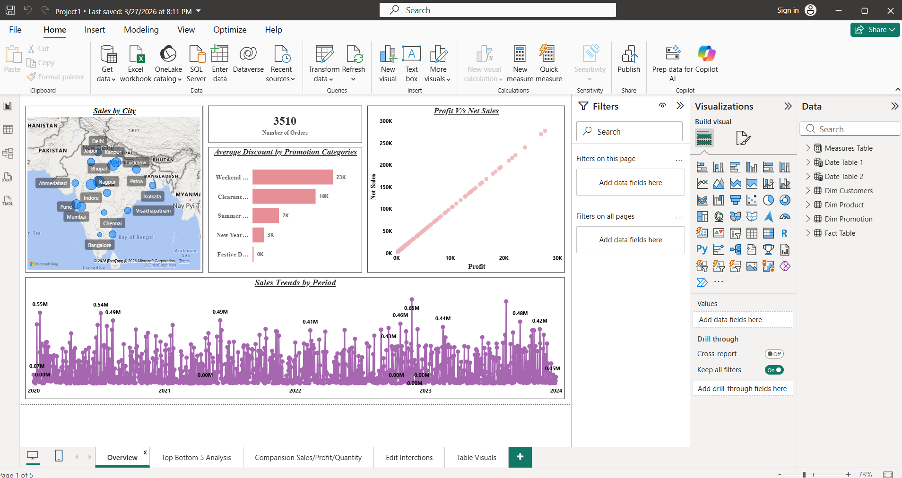
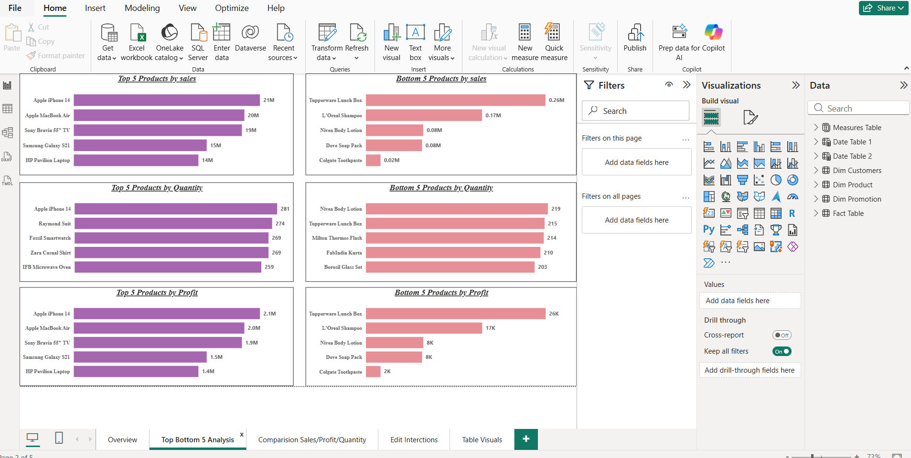
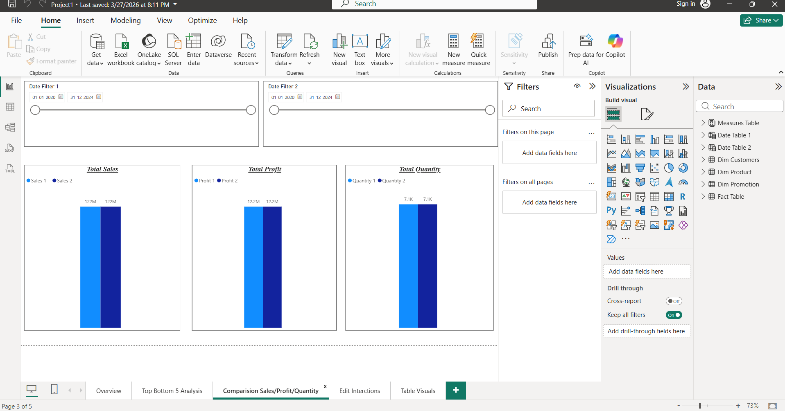
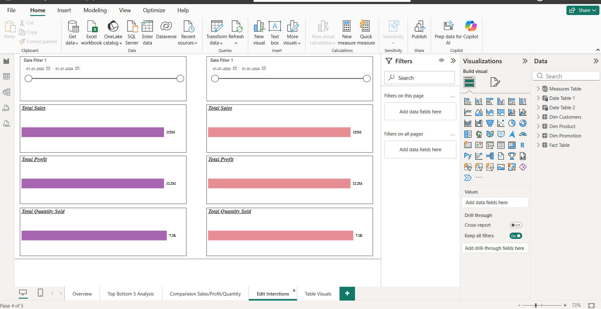
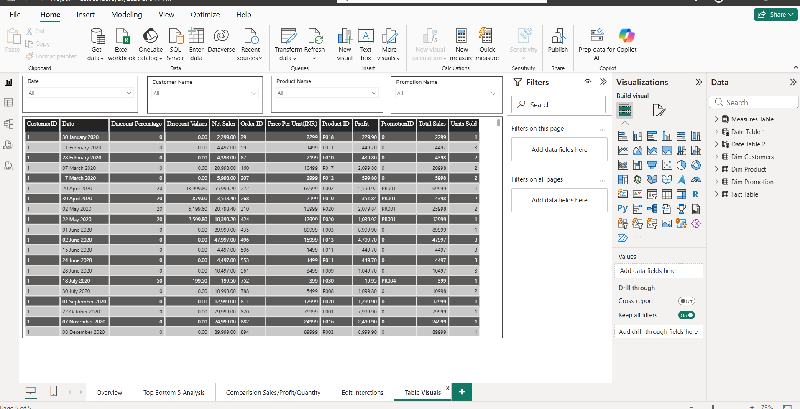

# Sales-Data-Analysis-Dashboard-using-Power-BI
Created a Power BI Sales Analytics Dashboard to analyze sales, profit, quantity sold, promotions and product performance. Performed data cleaning and transformation using Power Query, developed DAX measures and built interactive visualizations to deliver actionable business insights.

📌 Overview

This project presents an interactive Power BI Sales Dashboard developed to analyze sales performance, profitability, product trends, customer behavior and regional sales. The dashboard enables users to explore business insights through dynamic visualizations, KPIs and interactive filters, supporting data-driven decision-making.

📁 Dataset

The project uses a retail sales dataset containing customer details, product information, sales, profit, quantity sold, discounts, promotions and regional sales data to perform business analysis and build interactive dashboards.

🎯 Business Requirements

Analyze overall sales performance and profitability.

Identify top and bottom performing products.

Compare sales, profit, and quantity across different time periods.

Monitor regional sales performance.

Analyze promotional discounts and their impact.

Provide transaction-level reporting with interactive filters.

📊 Dashboard Pages

1️⃣ Overview

Total Orders KPI

Sales by City (Map)

Average Discount by Promotion Category

Profit vs Net Sales Analysis

Sales Trend Analysis

2️⃣ Top & Bottom 5 Analysis

Top 5 Products by Sales

Bottom 5 Products by Sales

Top 5 Products by Profit

Bottom 5 Products by Profit

Top & Bottom Products by Quantity Sold

3️⃣ Comparison Dashboard

Compare Sales, Profit, and Quantity between two selected date ranges using dynamic filters.

4️⃣ Edit Interactions

Demonstrates cross-filtering and interactions between Power BI visuals.

5️⃣ Table Visuals

Detailed transaction report with filters for Customer, Product, Date, and Promotion.

🛠️ Tools & Technologies

Power BI

Power Query

DAX

Microsoft Excel

Data Modeling

Data Visualization

📷 Dashboard Preview

Overview

Top & Bottom 5 Analysis

Comparison Dashboard

Edit Interactions

Table Visuals

